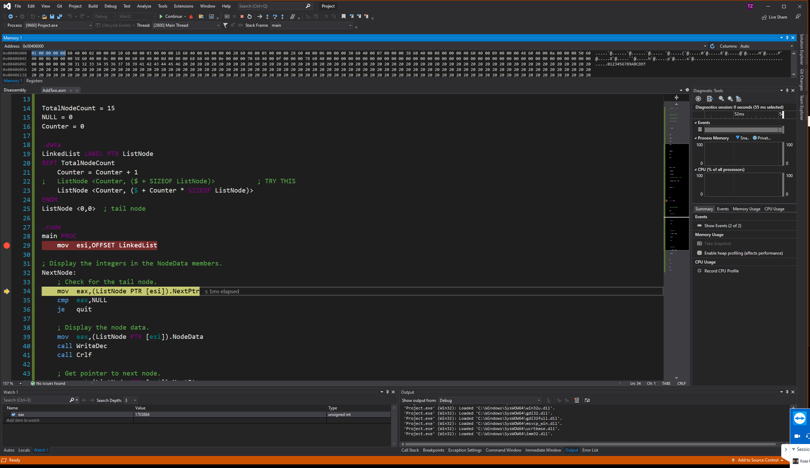

1. Project.lst:
```
00000000  00000001         1        ListNode <Counter, ($ + Counter * SIZEOF ListNode)>
       00000008 R
 00000008  00000002         1        ListNode <Counter, ($ + Counter * SIZEOF ListNode)>
       00000010 R
 00000010  00000003         1        ListNode <Counter, ($ + Counter * SIZEOF ListNode)>
       00000018 R
 00000018  00000004         1        ListNode <Counter, ($ + Counter * SIZEOF ListNode)>
       00000020 R
 00000020  00000005         1        ListNode <Counter, ($ + Counter * SIZEOF ListNode)>
       00000028 R
 00000028  00000006         1        ListNode <Counter, ($ + Counter * SIZEOF ListNode)>
       00000030 R
 00000030  00000007         1        ListNode <Counter, ($ + Counter * SIZEOF ListNode)>
       00000038 R
 00000038  00000008         1        ListNode <Counter, ($ + Counter * SIZEOF ListNode)>
       00000040 R
 00000040  00000009         1        ListNode <Counter, ($ + Counter * SIZEOF ListNode)>
       00000048 R
 00000048  0000000A         1        ListNode <Counter, ($ + Counter * SIZEOF ListNode)>
       00000050 R
 00000050  0000000B         1        ListNode <Counter, ($ + Counter * SIZEOF ListNode)>
       00000058 R
 00000058  0000000C         1        ListNode <Counter, ($ + Counter * SIZEOF ListNode)>
       00000060 R
 00000060  0000000D         1        ListNode <Counter, ($ + Counter * SIZEOF ListNode)>
       00000068 R
 00000068  0000000E         1        ListNode <Counter, ($ + Counter * SIZEOF ListNode)>
       00000070 R
 00000070  0000000F         1        ListNode <Counter, ($ + Counter * SIZEOF ListNode)>
       00000078 R
 00000078  00000000        ListNode <0,0>    ; tail node
       00000000
```
<div style="page-break-after: always; break-after: page;"></div>

2.

<div style="page-break-after: always; break-after: page;"></div>

3. Project.lst (looping linked list)
```
00000000  00000001         1        ListNode <Counter, ($ + SIZEOF ListNode)>            ; TRY THIS
       00000008 R
 00000008  00000002         1        ListNode <Counter, ($ + SIZEOF ListNode)>            ; TRY THIS
       00000008 R
 00000010  00000003         1        ListNode <Counter, ($ + SIZEOF ListNode)>            ; TRY THIS
       00000008 R
 00000018  00000004         1        ListNode <Counter, ($ + SIZEOF ListNode)>            ; TRY THIS
       00000008 R
 00000020  00000005         1        ListNode <Counter, ($ + SIZEOF ListNode)>            ; TRY THIS
       00000008 R
 00000028  00000006         1        ListNode <Counter, ($ + SIZEOF ListNode)>            ; TRY THIS
       00000008 R
 00000030  00000007         1        ListNode <Counter, ($ + SIZEOF ListNode)>            ; TRY THIS
       00000008 R
 00000038  00000008         1        ListNode <Counter, ($ + SIZEOF ListNode)>            ; TRY THIS
       00000008 R
 00000040  00000009         1        ListNode <Counter, ($ + SIZEOF ListNode)>            ; TRY THIS
       00000008 R
 00000048  0000000A         1        ListNode <Counter, ($ + SIZEOF ListNode)>            ; TRY THIS
       00000008 R
 00000050  0000000B         1        ListNode <Counter, ($ + SIZEOF ListNode)>            ; TRY THIS
       00000008 R
 00000058  0000000C         1        ListNode <Counter, ($ + SIZEOF ListNode)>            ; TRY THIS
       00000008 R
 00000060  0000000D         1        ListNode <Counter, ($ + SIZEOF ListNode)>            ; TRY THIS
       00000008 R
 00000068  0000000E         1        ListNode <Counter, ($ + SIZEOF ListNode)>            ; TRY THIS
       00000008 R
 00000070  0000000F         1        ListNode <Counter, ($ + SIZEOF ListNode)>            ; TRY THIS
       00000008 R
 00000078  00000000        ListNode <0,0>    ; tail node
       00000000
```
<div style="page-break-after: always; break-after: page;"></div>

4.
```as
.model flat

mLocate MACRO xval, yval
    IF xval LT 0
        EXITM
    ENDIF
    ;... ; reverse keywords' characters in the next three lines to get it right ;) and comment dots
    IF yval LT 0
        EXITM
    ENDIF
    ;.... ; up to here symbols are reversed ;)
    mov bx, 0    ; video page 0
    mov ah, 2    ; locate cursor
    mov dh, yval
    mov dl, xval

    IF IsDefined (RealMode)
        int 10h      ; call BIOS
    ENDIF
ENDM

.data
row BYTE 15
col BYTE 60
.code
main proc
    mLocate -2,20
    mLocate 10,20
    ; mLocate col,row

    mov eax, 0
    exit
main endp
end main

```

- Debugging macros is painful, and compilation errors typically come from macros.
- No the macros are not tested for passed variables or registers. To enable use of registers, you cannot compare with 0. You have to use the test `IF IDENTIFIER I EQUALS`.
- No. It was not executed because the `main proc` did not contain them.
- To compile and execute without errors, then you have to make sure that
    - `int 10h` is only available in real mode.

```as
IF IsDefined (RealMode)
    int 10h      ; call BIOS
ENDIF
```
