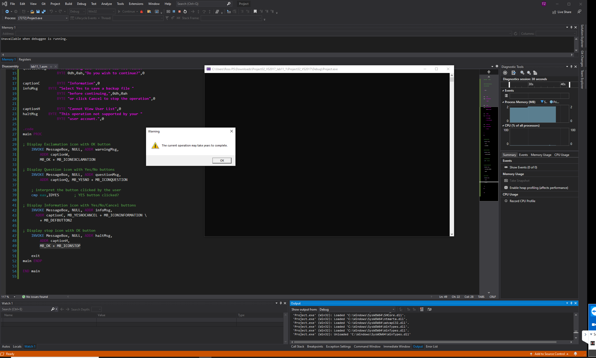
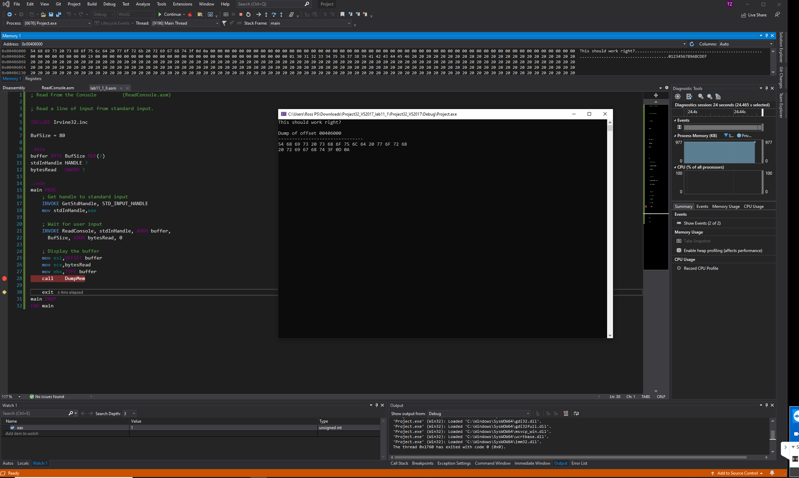
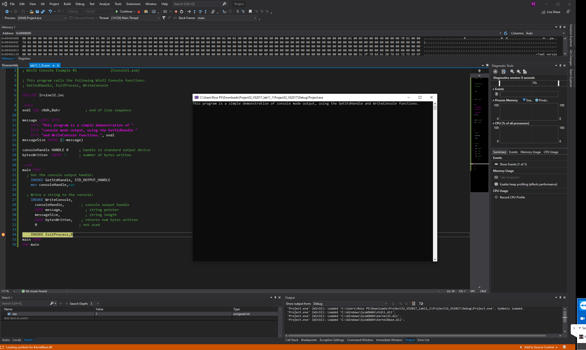
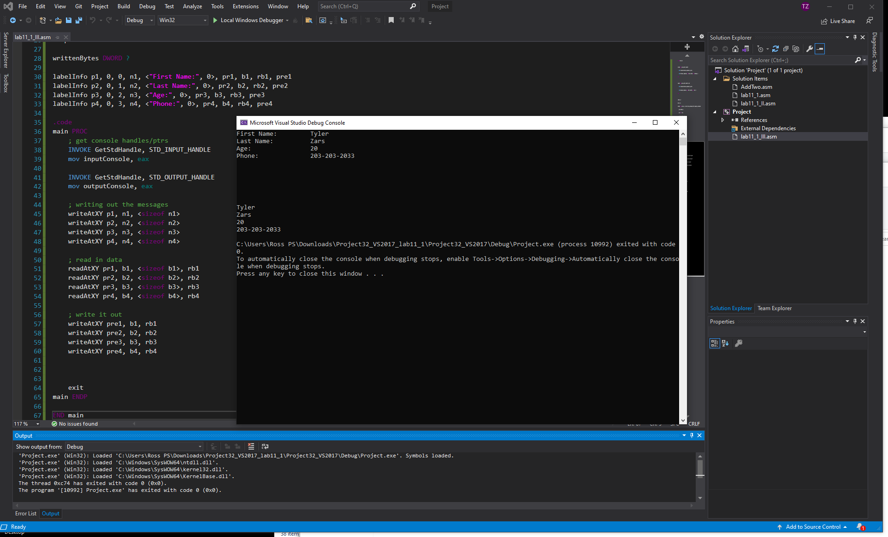

# lab-11.1

##### task 1:

```as {.line-numbers}
; Demonstrate MessageBoxA           (MessageBox.asm)

; Demonstration of the Windows API MessageBox function, using
; various icons and button configurations.

INCLUDE Irvine32.inc

.data
captionW		BYTE "Warning",0
warningMsg	BYTE "The current operation may take years "
				BYTE "to complete.",0

captionQ		BYTE "Question",0
questionMsg	BYTE "A matching user account was not found."
				BYTE 0dh,0ah,"Do you wish to continue?",0

captionC		BYTE "Information",0
infoMsg		BYTE "Select Yes to save a backup file "
				BYTE "before continuing,",0dh,0ah
				BYTE "or click Cancel to stop the operation",0

captionH		BYTE "Cannot View User List",0
haltMsg		BYTE "This operation not supported by your "
				BYTE "user account.",0

.code
main PROC

; Display Exclamation icon with OK button
	INVOKE MessageBox, NULL, ADDR warningMsg,
		ADDR captionW,
		MB_OK + MB_ICONEXCLAMATION

; Display Question icon with Yes/No buttons
	INVOKE MessageBox, NULL, ADDR questionMsg,
		ADDR captionQ, MB_YESNO + MB_ICONQUESTION

	; interpret the button clicked by the user
	cmp	eax,IDYES		; YES button clicked?

; Display Information icon with Yes/No/Cancel buttons
	INVOKE MessageBox, NULL, ADDR infoMsg,
	  ADDR captionC, MB_YESNOCANCEL + MB_ICONINFORMATION \
	  	+ MB_DEFBUTTON2

; Display stop icon with OK button
	INVOKE MessageBox, NULL, ADDR haltMsg,
		ADDR captionH,
		MB_OK + MB_ICONSTOP

	exit
main ENDP

END main
```

<div style="page-break-after: always; break-after: page;"></div>



<div style="page-break-after: always; break-after: page;"></div>

###### task 2:

```as {.line-numbers}
; Read From the Console         (ReadConsole.asm)

; Read a line of input from standard input.

INCLUDE Irvine32.inc

BufSize = 80

.data
buffer BYTE BufSize DUP(?)
stdInHandle HANDLE ?
bytesRead   DWORD ?

.code
main PROC
	; Get handle to standard input
	INVOKE GetStdHandle, STD_INPUT_HANDLE
	mov	stdInHandle,eax

	; Wait for user input
	INVOKE ReadConsole, stdInHandle, ADDR buffer,
	  BufSize, ADDR bytesRead, 0

	; Display the buffer
	mov	esi,OFFSET buffer
	mov	ecx,bytesRead
	mov	ebx,TYPE buffer
	call	DumpMem

	exit
main ENDP
END main
```

<div style="page-break-after: always; break-after: page;"></div>



<div style="page-break-after: always; break-after: page;"></div>

##### task 3:

```as {.line-numbers}
; Win32 Console Example #1                (Console1.asm)

; This program calls the following Win32 Console functions:
; GetStdHandle, ExitProcess, WriteConsole

INCLUDE Irvine32.inc

.data
endl EQU <0dh,0ah>			; end of line sequence

message LABEL BYTE
	BYTE "This program is a simple demonstration of "
	BYTE "console mode output, using the GetStdHandle "
	BYTE "and WriteConsole functions.", endl
messageSize DWORD ($-message)

consoleHandle HANDLE 0     ; handle to standard output device
bytesWritten  DWORD ?      ; number of bytes written

.code
main PROC
  ; Get the console output handle:
	INVOKE GetStdHandle, STD_OUTPUT_HANDLE
	mov consoleHandle,eax

  ; Write a string to the console:
	INVOKE WriteConsole,
	  consoleHandle,		; console output handle
	  ADDR message,       	; string pointer
	  messageSize,			; string length
	  ADDR bytesWritten,	; returns num bytes written
	  0					; not used

	INVOKE ExitProcess,0
main ENDP
END main
```



<div style="page-break-after: always; break-after: page;"></div>

##### task 4:

```as {.line-numbers}
INCLUDE Irvine32.inc

writeAtXY MACRO position, buffer, lenbuffer
    INVOKE SetConsoleCursorPosition, outputConsole, position
    INVOKE WriteConsole, outputConsole, ADDR buffer, lenbuffer, ADDR writtenBytes, 0
ENDM

readAtXY MACRO position, buffer, lenbuffer, result
    INVOKE SetConsoleCursorPosition, outputConsole, position
    INVOKE ReadConsole, inputConsole, ADDR buffer, lenbuffer, ADDR result, 0
ENDM

LENLABEL = 20
BUFSIZE = 30
labelInfo MACRO position, X, Y, nfield, vfield, positionRead, buffer, lReadBytes, positionResult
    position COORD<X, Y>
    nfield BYTE vfield
    positionRead COORD<X+LENLABEL, Y>
    positionResult COORD<X, Y+10>
    buffer BYTE BUFSIZE DUP(?)
    lReadBytes DWORD ?
ENDM

.data
inputConsole HANDLE 0
outputConsole HANDLE 0

writtenBytes DWORD ?

labelInfo p1, 0, 0, n1, <"First Name:", 0>, pr1, b1, rb1, pre1
labelInfo p2, 0, 1, n2, <"Last Name:", 0>, pr2, b2, rb2, pre2
labelInfo p3, 0, 2, n3, <"Age:", 0>, pr3, b3, rb3, pre3
labelInfo p4, 0, 3, n4, <"Phone:", 0>, pr4, b4, rb4, pre4

.code
main PROC
    ; get console handles/ptrs
    INVOKE GetStdHandle, STD_INPUT_HANDLE
    mov inputConsole, eax

    INVOKE GetStdHandle, STD_OUTPUT_HANDLE
    mov outputConsole, eax

    ; writing out the messages
    writeAtXY p1, n1, <sizeof n1>
    writeAtXY p2, n2, <sizeof n2>
    writeAtXY p3, n3, <sizeof n3>
    writeAtXY p4, n4, <sizeof n4>

    ; read in data
    readAtXY pr1, b1, <sizeof b1>, rb1
    readAtXY pr2, b2, <sizeof b2>, rb2
    readAtXY pr3, b3, <sizeof b3>, rb3
    readAtXY pr4, b4, <sizeof b4>, rb4

    ; write it out
    writeAtXY pre1, b1, rb1
    writeAtXY pre2, b2, rb2
    writeAtXY pre3, b3, rb3
    writeAtXY pre4, b4, rb4

    exit
main ENDP

END main
```


