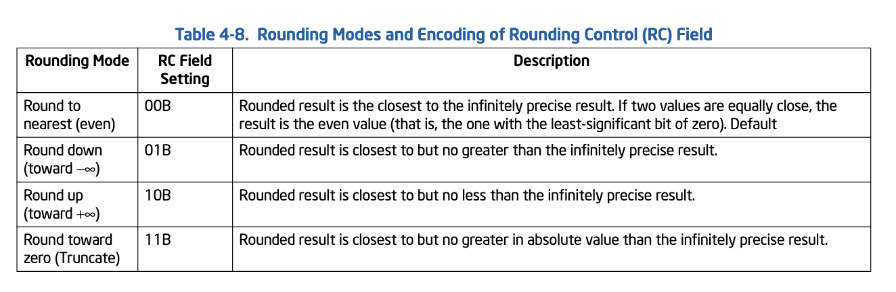
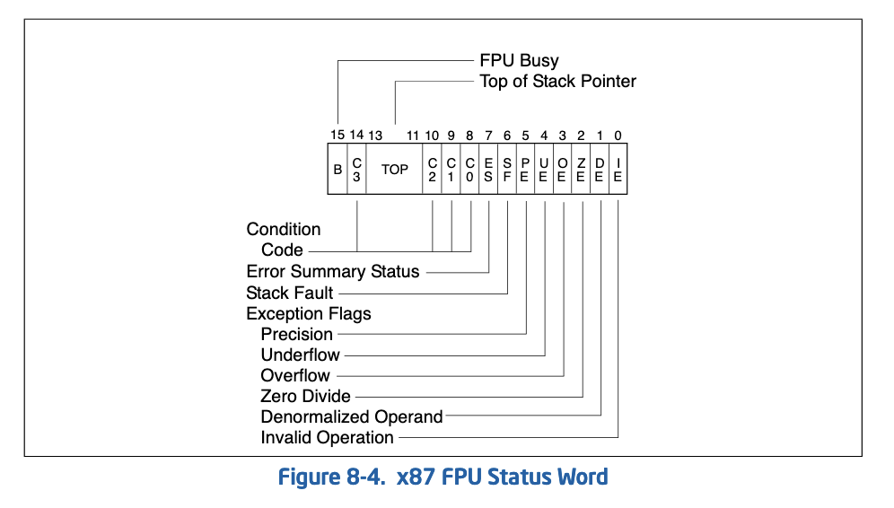
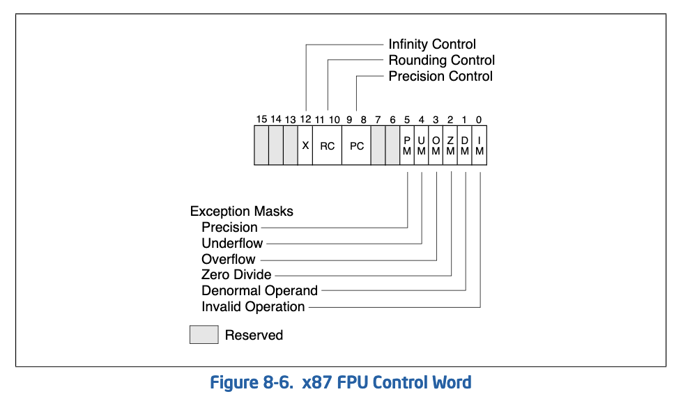
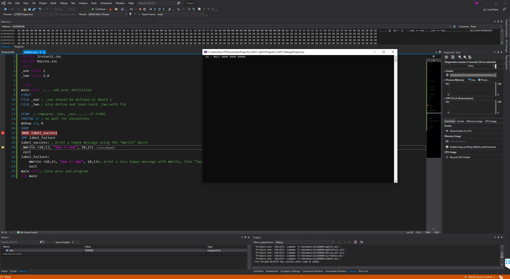
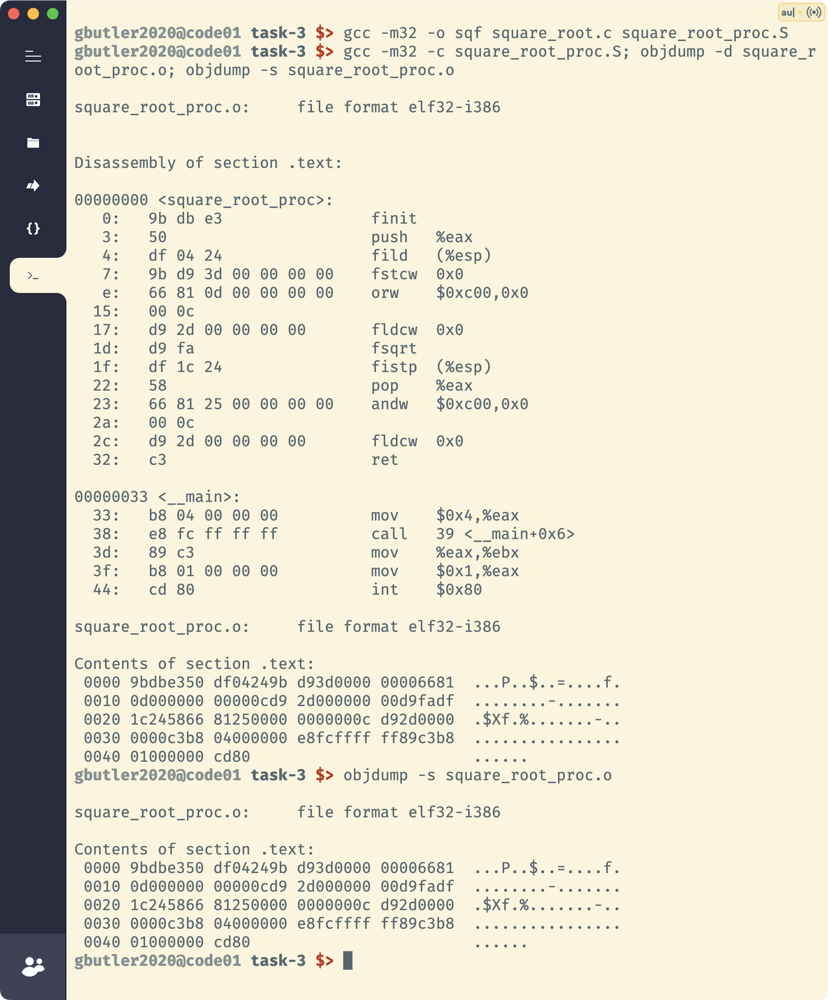
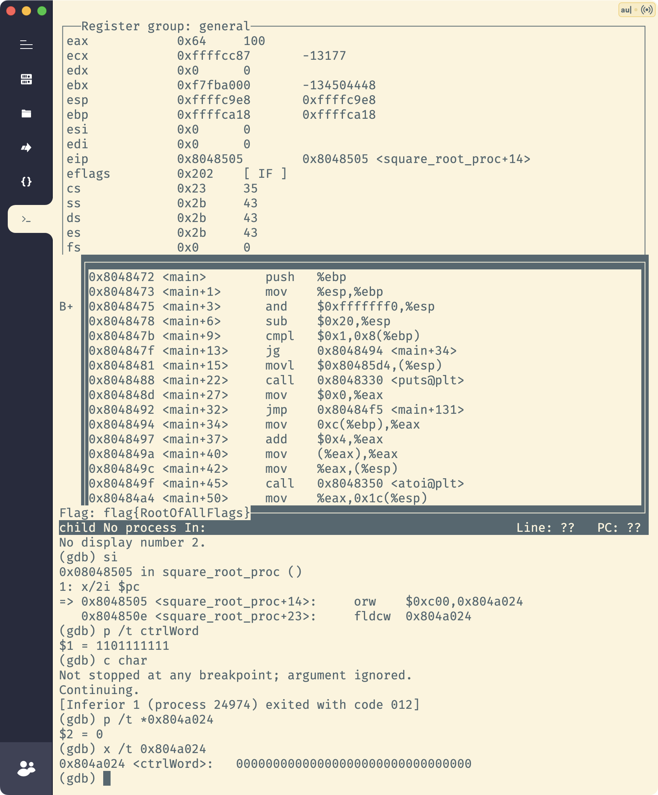

##### task1:
```
CHAPTER 8
PROGRAMMING WITH THE X87 FPU
8.1 X87 FPU EXECUTION ENVIRONMENT . . . . . . . . . . . . . . . . . . . . . . . . . . . . . . . . . . . . . . . . . . . . . . . . . . . . . . . . . . . . . . . . . . . . . . . . . . . . . . . 8-1
8.1.1 x87 FPU in 64-Bit Mode and Compatibility Mode . . . . . . . . . . . . . . . . . . . . . . . . . . . . . . . . . . . . . . . . . . . . . . . . . . . . . . . . . . . . . . . . . .8-1
8.1.2 x87 FPU Data Registers . . . . . . . . . . . . . . . . . . . . . . . . . . . . . . . . . . . . . . . . . . . . . . . . . . . . . . . . . . . . . . . . . . . . . . . . . . . . . . . . . . . . . . . . .8-1
8.1.2.1 Parameter Passing With the x87 FPU Register Stack . . . . . . . . . . . . . . . . . . . . . . . . . . . . . . . . . . . . . . . . . . . . . . . . . . . . . . . . . . .8-3
8.1.3 x87 FPU Status Register. . . . . . . . . . . . . . . . . . . . . . . . . . . . . . . . . . . . . . . . . . . . . . . . . . . . . . . . . . . . . . . . . . . . . . . . . . . . . . . . . . . . . . . . .8-4
8.1.3.1 Top of Stack (TOP) Pointer. . . . . . . . . . . . . . . . . . . . . . . . . . . . . . . . . . . . . . . . . . . . . . . . . . . . . . . . . . . . . . . . . . . . . . . . . . . . . . . . . . . .8-4
8.1.3.2 Condition Code Flags . . . . . . . . . . . . . . . . . . . . . . . . . . . . . . . . . . . . . . . . . . . . . . . . . . . . . . . . . . . . . . . . . . . . . . . . . . . . . . . . . . . . . . . . .8-4
8.1.3.3 x87 FPU Floating-Point Exception Flags . . . . . . . . . . . . . . . . . . . . . . . . . . . . . . . . . . . . . . . . . . . . . . . . . . . . . . . . . . . . . . . . . . . . . . .8-5
8.1.3.4 Stack Fault Flag . . . . . . . . . . . . . . . . . . . . . . . . . . . . . . . . . . . . . . . . . . . . . . . . . . . . . . . . . . . . . . . . . . . . . . . . . . . . . . . . . . . . . . . . . . . . . .8-6
8.1.4 Branching and Conditional Moves on Condition Codes. . . . . . . . . . . . . . . . . . . . . . . . . . . . . . . . . . . . . . . . . . . . . . . . . . . . . . . . . . . . . .8-6
8.1.5 x87 FPU Control Word . . . . . . . . . . . . . . . . . . . . . . . . . . . . . . . . . . . . . . . . . . . . . . . . . . . . . . . . . . . . . . . . . . . . . . . . . . . . . . . . . . . . . . . . . . .8-7
8.1.5.1 x87 FPU Floating-Point Exception Mask Bits . . . . . . . . . . . . . . . . . . . . . . . . . . . . . . . . . . . . . . . . . . . . . . . . . . . . . . . . . . . . . . . . . . .8-7
8.1.5.2 Precision Control Field . . . . . . . . . . . . . . . . . . . . . . . . . . . . . . . . . . . . . . . . . . . . . . . . . . . . . . . . . . . . . . . . . . . . . . . . . . . . . . . . . . . . . . . .8-7
8.1.5.3 Rounding Control Field. . . . . . . . . . . . . . . . . . . . . . . . . . . . . . . . . . . . . . . . . . . . . . . . . . . . . . . . . . . . . . . . . . . . . . . . . . . . . . . . . . . . . . . .8-8
8.1.6 Infinity Control Flag. . . . . . . . . . . . . . . . . . . . . . . . . . . . . . . . . . . . . . . . . . . . . . . . . . . . . . . . . . . . . . . . . . . . . . . . . . . . . . . . . . . . . . . . . . . . . .8-8
8.1.7 x87 FPU Tag Word . . . . . . . . . . . . . . . . . . . . . . . . . . . . . . . . . . . . . . . . . . . . . . . . . . . . . . . . . . . . . . . . . . . . . . . . . . . . . . . . . . . . . . . . . . . . . .8-8
8.1.8 x87 FPU Instruction and Data (Operand) Pointers . . . . . . . . . . . . . . . . . . . . . . . . . . . . . . . . . . . . . . . . . . . . . . . . . . . . . . . . . . . . . . . . .8-9
8.1.9 Last Instruction Opcode. . . . . . . . . . . . . . . . . . . . . . . . . . . . . . . . . . . . . . . . . . . . . . . . . . . . . . . . . . . . . . . . . . . . . . . . . . . . . . . . . . . . . . . . 8-10
8.1.9.1 Fopcode Compatibility Sub-mode . . . . . . . . . . . . . . . . . . . . . . . . . . . . . . . . . . . . . . . . . . . . . . . . . . . . . . . . . . . . . . . . . . . . . . . . . . . . 8-10
8.1.10 Saving the x87 FPU’s State with FSTENV/FNSTENV and FSAVE/FNSAVE. . . . . . . . . . . . . . . . . . . . . . . . . . . . . . . . . . . . . . . . . 8-11
8.1.11 Saving the x87 FPU’s State with FXSAVE. . . . . . . . . . . . . . . . . . . . . . . . . . . . . . . . . . . . . . . . . . . . . . . . . . . . . . . . . . . . . . . . . . . . . . . 8-12
8.2 X87 FPU DATA TYPES . . . . . . . . . . . . . . . . . . . . . . . . . . . . . . . . . . . . . . . . . . . . . . . . . . . . . . . . . . . . . . . . . . . . . . . . . . . . . . . . . . . . . . . . . . . . 8-13
8.2.1 Indefinites . . . . . . . . . . . . . . . . . . . . . . . . . . . . . . . . . . . . . . . . . . . . . . . . . . . . . . . . . . . . . . . . . . . . . . . . . . . . . . . . . . . . . . . . . . . . . . . . . . . . 8-14
8.2.2 Unsupported Double Extended-Precision
Floating-Point Encodings and Pseudo-Denormals . . . . . . . . . . . . . . . . . . . . . . . . . . . . . . . . . . . . . . . . . . . . . . . . . . . . . . . . . . . . . . . . 8-14
8.3 X87 FPU INSTRUCTION SET. . . . . . . . . . . . . . . . . . . . . . . . . . . . . . . . . . . . . . . . . . . . . . . . . . . . . . . . . . . . . . . . . . . . . . . . . . . . . . . . . . . . . . . 8-15
8.3.1 Escape (ESC) Instructions . . . . . . . . . . . . . . . . . . . . . . . . . . . . . . . . . . . . . . . . . . . . . . . . . . . . . . . . . . . . . . . . . . . . . . . . . . . . . . . . . . . . . . 8-15
8.3.2 x87 FPU Instruction Operands . . . . . . . . . . . . . . . . . . . . . . . . . . . . . . . . . . . . . . . . . . . . . . . . . . . . . . . . . . . . . . . . . . . . . . . . . . . . . . . . . 8-15
8.3.3 Data Transfer Instructions . . . . . . . . . . . . . . . . . . . . . . . . . . . . . . . . . . . . . . . . . . . . . . . . . . . . . . . . . . . . . . . . . . . . . . . . . . . . . . . . . . . . . 8-16
8.3.4 Load Constant Instructions. . . . . . . . . . . . . . . . . . . . . . . . . . . . . . . . . . . . . . . . . . . . . . . . . . . . . . . . . . . . . . . . . . . . . . . . . . . . . . . . . . . . . 8-18
8.3.5 Basic Arithmetic Instructions . . . . . . . . . . . . . . . . . . . . . . . . . . . . . . . . . . . . . . . . . . . . . . . . . . . . . . . . . . . . . . . . . . . . . . . . . . . . . . . . . . . 8-18
8.3.6 Comparison and Classification Instructions . . . . . . . . . . . . . . . . . . . . . . . . . . . . . . . . . . . . . . . . . . . . . . . . . . . . . . . . . . . . . . . . . . . . . . 8-19
8.3.6.1 Branching on the x87 FPU Condition Codes . . . . . . . . . . . . . . . . . . . . . . . . . . . . . . . . . . . . . . . . . . . . . . . . . . . . . . . . . . . . . . . . . . 8-20
8.3.7 Trigonometric Instructions . . . . . . . . . . . . . . . . . . . . . . . . . . . . . . . . . . . . . . . . . . . . . . . . . . . . . . . . . . . . . . . . . . . . . . . . . . . . . . . . . . . . . 8-21
8.3.8 Approximation of Pi . . . . . . . . . . . . . . . . . . . . . . . . . . . . . . . . . . . . . . . . . . . . . . . . . . . . . . . . . . . . . . . . . . . . . . . . . . . . . . . . . . . . . . . . . . . 8-21
8.3.9 Logarithmic, Exponential, and Scale. . . . . . . . . . . . . . . . . . . . . . . . . . . . . . . . . . . . . . . . . . . . . . . . . . . . . . . . . . . . . . . . . . . . . . . . . . . . . 8-22
8.3.10 Transcendental Instruction Accuracy . . . . . . . . . . . . . . . . . . . . . . . . . . . . . . . . . . . . . . . . . . . . . . . . . . . . . . . . . . . . . . . . . . . . . . . . . . . 8-22
8.3.11 x87 FPU Control Instructions. . . . . . . . . . . . . . . . . . . . . . . . . . . . . . . . . . . . . . . . . . . . . . . . . . . . . . . . . . . . . . . . . . . . . . . . . . . . . . . . . . . 8-24
8.3.12 Waiting vs. Non-waiting Instructions. . . . . . . . . . . . . . . . . . . . . . . . . . . . . . . . . . . . . . . . . . . . . . . . . . . . . . . . . . . . . . . . . . . . . . . . . . . . 8-24
8.3.13 Unsupported x87 FPU Instructions . . . . . . . . . . . . . . . . . . . . . . . . . . . . . . . . . . . . . . . . . . . . . . . . . . . . . . . . . . . . . . . . . . . . . . . . . . . . . 8-25
8.4 X87 FPU FLOATING-POINT EXCEPTION HANDLING . . . . . . . . . . . . . . . . . . . . . . . . . . . . . . . . . . . . . . . . . . . . . . . . . . . . . . . . . . . . . . . . . 8-25
8.4.1 Arithmetic vs. Non-arithmetic Instructions . . . . . . . . . . . . . . . . . . . . . . . . . . . . . . . . . . . . . . . . . . . . . . . . . . . . . . . . . . . . . . . . . . . . . . 8-25
8.5 X87 FPU FLOATING-POINT EXCEPTION CONDITIONS . . . . . . . . . . . . . . . . . . . . . . . . . . . . . . . . . . . . . . . . . . . . . . . . . . . . . . . . . . . . . . . 8-26
8.5.1 Invalid Operation Exception . . . . . . . . . . . . . . . . . . . . . . . . . . . . . . . . . . . . . . . . . . . . . . . . . . . . . . . . . . . . . . . . . . . . . . . . . . . . . . . . . . . . 8-27
8.5.1.1 Stack Overflow or Underflow Exception (#IS) . . . . . . . . . . . . . . . . . . . . . . . . . . . . . . . . . . . . . . . . . . . . . . . . . . . . . . . . . . . . . . . . 8-27
8.5.1.2 Invalid Arithmetic Operand Exception (#IA) . . . . . . . . . . . . . . . . . . . . . . . . . . . . . . . . . . . . . . . . . . . . . . . . . . . . . . . . . . . . . . . . . . 8-27
8.5.2 Denormal Operand Exception (#D). . . . . . . . . . . . . . . . . . . . . . . . . . . . . . . . . . . . . . . . . . . . . . . . . . . . . . . . . . . . . . . . . . . . . . . . . . . . . . 8-28
8.5.3 Divide-By-Zero Exception (#Z) . . . . . . . . . . . . . . . . . . . . . . . . . . . . . . . . . . . . . . . . . . . . . . . . . . . . . . . . . . . . . . . . . . . . . . . . . . . . . . . . . 8-29
8.5.4 Numeric Overflow Exception (#O) . . . . . . . . . . . . . . . . . . . . . . . . . . . . . . . . . . . . . . . . . . . . . . . . . . . . . . . . . . . . . . . . . . . . . . . . . . . . . . 8-29
8.5.5 Numeric Underflow Exception (#U) . . . . . . . . . . . . . . . . . . . . . . . . . . . . . . . . . . . . . . . . . . . . . . . . . . . . . . . . . . . . . . . . . . . . . . . . . . . . . 8-30
8.5.6 Inexact-Result (Precision) Exception (#P) . . . . . . . . . . . . . . . . . . . . . . . . . . . . . . . . . . . . . . . . . . . . . . . . . . . . . . . . . . . . . . . . . . . . . . . 8-31
8.6 X87 FPU EXCEPTION SYNCHRONIZATION. . . . . . . . . . . . . . . . . . . . . . . . . . . . . . . . . . . . . . . . . . . . . . . . . . . . . . . . . . . . . . . . . . . . . . . . . . 8-31
8.7 HANDLING X87 FPU EXCEPTIONS IN SOFTWARE . . . . . . . . . . . . . . . . . . . . . . . . . . . . . . . . . . . . . . . . . . . . . . . . . . . . . . . . . . . . . . . . . . . 8-32
8.7.1 Native Mode. . . . . . . . . . . . . . . . . . . . . . . . . . . . . . . . . . . . . . . . . . . . . . . . . . . . . . . . . . . . . . . . . . . . . . . . . . . . . . . . . . . . . . . . . . . . . . . . . . . 8-32
8.7.2 MS-DOS* Compatibility Sub-mode. . . . . . . . . . . . . . . . . . . . . . . . . . . . . . . . . . . . . . . . . . . . . . . . . . . . . . . . . . . . . . . . . . . . . . . . . . . . . . . 8-33
8.7.3 Handling x87 FPU Exceptions in Software . . . . . . . . . . . . . . . . . . . . . . . . . . . . . . . . . . . . . . . . . . . . . . . . . . . . . . . . . . . . . . . . . . . . . . 8-33
```
<div style="page-break-after: always; break-after: page;"></div>

##### 4.8.4:

The round up and round down modes are termed directed rounding and can be used to implement interval arithmetic. Interval arithmetic is used to determine upper and lower bounds for the true result of a multistep computation, when the intermediate results of the computation are subject to rounding.The round toward zero mode (sometimes called the “chop” mode) is commonly used when performing integer arithmetic with the x87 FPU.
The rounded result is called the inexact result. When the processor produces an inexact result, the floating-point precision (inexact) flag (PE) is set (see Section 4.9.1.6, “Inexact-Result (Precision) Exception (#P)”). The rounding modes have no effect on comparison operations, operations that produce exact results, or operations that produce NaN results. 4.8.4.1 Rounding Control (RC) Fields In the Intel 64 and IA-32 architectures, the rounding mode is controlled by a 2-bit rounding-control (RC) field (Table 4-8 shows the encoding of this field). The RC field is implemented in two different locations:
- x87 FPU control register (bits 10 and 11)
- The MXCSR register (bits 13 and 14)
Although these two RC fields perform the same function, they control rounding for different execution environments within the processor. The RC field in the x87 FPU control register controls rounding for computations performed with the x87 FPU instructions; the RC field in the MXCSR register controls rounding for SIMD floating-point computations performed with the SSE/SSE2 instructions.

##### 8.1.3 x87 FPU Status Register
The 16-bit x87 FPU status register (see Figure 8-4) indicates the current state of the x87 FPU. The flags in the x87 FPU status register include the FPU busy flag, top-of-stack (TOP) pointer, condition code flags, error summary status flag, stack fault flag, and exception flags. The x87 FPU sets the flags in this register to show the results of operations.



The contents of the x87 FPU status register (referred to asthe x87 FPU status word) can be stored in memory using the FSTSW/FNSTSW, FSTENV/FNSTENV, FSAVE/FNSAVE, and FXSAVE instructions. It can also be stored in the AX register of the integer unit, using the FSTSW/FNSTSW instructions.

##### 8.1.5 x87 FPU Control Word
The 16-bit x87 FPU control word (see Figure 8-6) controls the precision of the x87 FPU and rounding method used. It also contains the x87 FPU floating-point exception mask bits. The control word is cached in the x87 FPU control register. The contents of this register can be loaded with the FLDCW instruction and stored in memory with the FSTCW/FNSTCW instructions.



When the x87 FPU is initialized with either an FINIT/FNINIT or FSAVE/FNSAVE instruction, the x87 FPU control word is set to 037FH, which masks all floating-point exceptions, sets rounding to nearest, and sets the x87 FPU precision to 64 bits.
<div style="page-break-after: always; break-after: page;"></div>

##### task2:
```
INCLUDE Irvine32.inc
INCLUDE Macros.inc
.data
_one DWORD 1
_two REAL4 2.0

.code
main PROC  ;... add proc definition
FINIT
FILD _one ; _one should be defined as dword 1
FILD _two ; also define and load real4 _two with fld

FCOM  ; compares _two, _one...... cf FCOMI
FNSTSW AX ; no wait for exceptions
mShow AX, B
SAHF
JNBE label_success
JMP label_failure
label_success: ; print a happy message using the "mWrite" macro
 mWrite <10,13, "two <= one", 10,13>
 exit
label_failure:
	mWrite <10,13, "one <= two", 10,13>; print a less happy message with mWrite, like "two <= one"
	exit
main ENDP; close proc and program
END main

```


<div style="page-break-after: always; break-after: page;"></div>

##### task3:
```bash
gbutler2020@code01 task-3 $> objdump -s square_root_proc.o

square_root_proc.o:     file format elf32-i386

Contents of section .text:
 0000 9bdbe350 df04249b d93d0000 00006681  ...P..$..=....f.
 0010 0d000000 00000cd9 2d000000 00d9fadf  ........-.......
 0020 1c245866 81250000 0000000c d92d0000  .$Xf.%.......-..
 0030 0000c3b8 04000000 e8fcffff ff89c3b8  ................
 0040 01000000 cd80                        ......
 ```


<div style="page-break-after: always; break-after: page;"></div>

##### task4:

